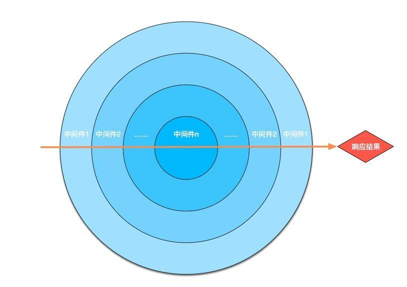
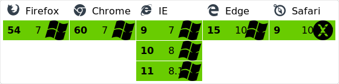

# Webpack3 + Vue2 + Koa2 构建应用

该构建适用PC端开发，通过配置亦可支持移动端开发

### 技术栈
* Webpack3
* Koa2
* Axios
* Vue2 & vue-router
* Babel Es6/7
* Eslint
* stylus postcss

```html
$ npm i 安装npm包
$ npm start 启动项目
```

注: 该构建用到的npm包说明参考 `doc`目录下的 npm包说明.md文档

### 目录结构


### Webpack3
```html
$ npm i webpack -D
```
webpack 的配置项主要包括以下几点：
* entry: 入口,String||Array||Object
* output: 出口，定义打包输出的文件；包括路径，文件名，还可能有运行时的访问路径（publicPath）参数
* module: webpack将所有的资源都看做是模块，而模块就需要加载器；主要定义一些loaders,定义哪些后缀名的文件应该用哪些loader
* test: 检测哪些文件需要此loader，是一个正则表达式
* exclude: 忽略哪些文件
* resolve: 定义能够被打包的文件，文件后缀名
* plugins: 定义一些额外的插件
* ...

webpack配置文件
* 基础配置`webpack.config.base`
* 开发配置`webpack.config.dev.js`
* 生产配置`webpack.config.prod.js`

Webpack配置可以参考[官方](https://webpack.js.org/configuration/) or [Webpack中文文档](http://www.css88.com/doc/webpack/)

### Koa2
koa的中间件是由generator组成的。
从第一个中间件开始执行，遇到next进入下一个中间件，一直执行到最后一个中间件，
在逆序，执行上一个中间件next之后的代码，一直到第一个中间件执行结束才发出响应。



这里Koa2的中间件必须使用ES7语法 async/await

Koa2 取代webpack-dev-server作为打包服务的部署方案，代码如下：
```js
const app = new Koa()
const uri = 'http://' + currentIP + ':' + appConfig.appPort

const devMiddleware = webpackDevMiddleware(clientCompiler, {
  publicPath: config.output.publicPath,
  headers: { 'Access-Control-Allow-Origin': '*' },
  stats: {
    colors: true,
  },
  noInfo: false,
  watchOptions: {
    aggregateTimeout: 300,
    poll: true
  },
})
// 中间件,一组async函数，generator函数需要convert转换
const middleWares = [
  // 日志记录
  loggerMiddleware,
  // 压缩响应
  require('koa-compress')(),
  // 错误处理
  errorMiddleware,
  // webpack开发中间件
  convert(devMiddleware),
  // webpack热替换中间件
  convert(webpackHotMiddleware(clientCompiler)),
  // 手动设置cookie方法
  setCookieMiddleware,
  // http中间件
  httpMiddleware(),
  // 插入自定义中间件
  ...appConfig.middleWares,
  // 路由
  KoaRouter.middleware(),
  // 代理中间件
  proxyMiddleware(),
]

middleWares.forEach((middleware) => {
  if (!middleware) {
    return
  }
  app.use(middleware)
})

console.log('> Starting dev server...')

devMiddleware.waitUntilValid(() => {
  console.log('> Listening at ' + uri + '\n')
  opn(uri)
})

// 错误处理
app.on('error', (err) => {
  console.error('Server error: \n%s\n%s ', err.stack || '')
})

const server = app.listen(appConfig.appPort)

process.on('SIGTERM', () => {
  console.log('Stopping dev server')
  devMiddleware.close()
  server.close(() => {
    process.exit(0)
  })
})
```
### Babel Es6/7
* `babel-core`
* `babel-preset-es2015`  打包了 es6 的特性 
* `babel-preset-latest` latest是一个特殊的presets，包括了es2015，es2016，es2017的插件（目前为止，以后有es2018也会包括进去）。 即总是包含最新的编译插件。 

* `babel-preset-env`

推荐使用`babel-preset-env`，其他模式会把浏览器支持的一些es6/7新特性转成ES5代码，有点浪费。

###  Axios
基于 Promise 的 HTTP 请求客户端，可同时在浏览器和 node.js 中使用

浏览器支持


使用HTTP请求
```html
对于在vue组件中使用：
this.http.get(url, options)
this.http.delete(url, options)
this.http.post(url, data, options)
this.http.put(url, data, options)

对于非vue组件中使用：

import http from '@config/utils/http'

http.get(url, options)
http.delete(url, options)
http.post(url, data, options)
http.put(url, data, options)

对于post和put方法，必须提供第二个data参数，即提供一个空对象，比如：

this.http.post(url, {})

```

### 使用 ESlint 进行代码检查
特点:
* 默认规则包含所有 JSLint、JSHint 中存在的规则，易迁移
* 规则可配置性高：可设置「警告」、「错误」两个 error 等级，或者直接禁用
.eslintrc.js配置文件常见的格式

```html
{
  root: true,
  parserOptions: { //EsLint通过parserOptions，允许指定校验的ecma的版本，及ecma的一些特性
    ecmaVersion: 6, //指定ECMAScript支持的版本，6为ES6
    sourceType: 'module', //指定来源的类型，有两种”script”或”module”
    ecmaFeatures: { // ecmaFeatures指定你想使用哪些额外的语言特性
    experimentalObjectRestSpread: true,
    }
  },
  parser: 'babel-eslint', // EsLint默认使用esprima做脚本解析，也可以切换成babel-eslint解析
  env: { // Environment可以预设好的其他环境的全局变量，如brower、node环境变量、es6环境变量、mocha环境变量等
    browser: true,
    node: true,
    es6: true,
    mocha: true
  },
  plugins: [ // EsLint允许使用第三方插件
    'html',
    'import',
    'promise',
  ],
  extends: 'standard', // Extends是EsLint默认推荐的验证你可以使用配置选择哪些校验是你所需要的
  rules: [ // 自定义规则
  ],
  globals: { // 即插件在执行过程中用到的其它全局变量
  }
}
```

### pre-commit钩子函数
github提交前验证eslint规则，通过才能提交

### app.config.js
```html
module.exports = {
  // 主服务启动端口
  appPort: serverConfig.appPort,
  // 代理配置，可支持多个代理，key为前缀，命中后，会把前缀去掉，转发到代理服务器
  proxy: serverConfig.proxy,
  // webpack服务端口,分离模式启动时用到
  webpackDevServerPort: 9002,
  // webpack的差异化配置
  webpack: {
    entry: {
      app: path.join(__dirname, 'client/index.js'), // 入口
      vendor: ['vue', 'vue-router', 'vue-template-compiler'] // 拆分框架代码
    },
    // 是否对样式启用px到rem的转换,配合config/utils/responsive-design.js适配移动端开发， 默认不开启
    enablePx2Rem: false,
    // 自定义Alias设置
    resolveAlias: {},
    // 扩展rules
    rules: [],
    // 扩展css postcss
    postcss: [],
  },
  // 自定义中间件 async await函数写法
  middleWares: []
}

```
### logger日志
logger只在非生产环境起作用

```html
this.log(msg)
this.info(msg)
this.warn(msg)
this.error(msg)
```


### Configuration tasks/命令
* npm start: 启动开发模式下的server
* npm run prod:  启动生产服务，前提必须 npm run build打包
* npm run build: 打包生产模式的代码
* npm run fix-client: 修复大部分Eslint规则


### Linux环境部署

* git clone 或 git pull 拉取代码
* npm i 安装npm包
* npm run build 打包生产代码
* nohup npm run prod > myLog.log 2>&1 &exit      //启动服务并退出 适用命令窗口，用工具的无视

pkill node   //关闭 node 服务


继续完善....
