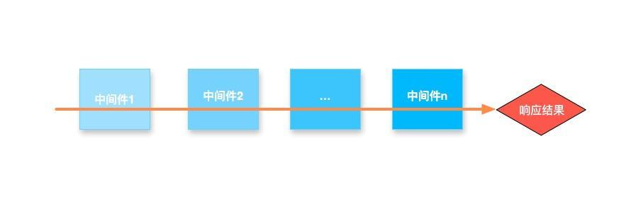
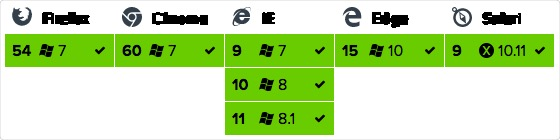

# Webpack3 + Vue2 + Koa2 构建脚手架

该构建适用PC端开发，通过配置亦可支持移动端开发

### 技术栈
* Webpack3
* Koa2
* Axios
* Vue2 & vue-router
* Es6/7
* stylus postcss


注: 该构建用到的npm包说明参考 `doc`目录下的 npm包说明.md文档
### Webpack3
```html
$ npm i webpack -D
```
webpack 的配置项主要包括以下几点：
* entry: 入口,String||Array||Object
* output: 出口，定义打包输出的文件；包括路径，文件名，还可能有运行时的访问路径（publicPath）参数
* module: webpack将所有的资源都看做是模块，而模块就需要加载器；主要定义一些loaders,定义哪些后缀名的文件应该用哪些loader
* test: 检测哪些文件需要此loader，是一个正则表达式
* exclude: 忽略哪些文件
* resolve: 定义能够被打包的文件，文件后缀名
* plugins: 定义一些额外的插件
* ...

webpack配置文件分三个
* 基础配置`webpack.config.base`
* 开发配置`webpack.config.dev.js`
* 生产配置`webpack.config.prod.js`
Webpack配置可以参考[官方](https://webpack.js.org/configuration/) or [Webpack中文文档](http://www.css88.com/doc/webpack/)

### Koa2
koa 是由 Express 原班人马打造的，致力于成为一个更小、更富有表现力、更健壮的 Web 框架。
使用 koa 编写 web 应用，通过组合不同的 generator，可以免除重复繁琐的回调函数嵌套，并极大地提升错误处理的效率。

Express的中间件是顺序执行，从第一个中间件执行到最后一个中间件，发出响应。


koa的中间件是由generator组成的

koa是从第一个中间件开始执行，遇到next进入下一个中间件，一直执行到最后一个中间件，在逆序，执行上一个中间件next之后的代码，一直到第一个中间件执行结束才发出响应。


这里Koa2的中间件必须使用ES7语法 async/await

Koa2 取代webpack-dev-server作为打包服务的部署方案，代码如下：
```js
const app = new Koa()
const uri = 'http://' + currentIP + ':' + appConfig.appPort

const devMiddleware = webpackDevMiddleware(clientCompiler, {
  publicPath: config.output.publicPath,
  headers: { 'Access-Control-Allow-Origin': '*' },
  stats: {
    colors: true,
  },
  noInfo: false,
  watchOptions: {
    aggregateTimeout: 300,
    poll: true
  },
})
// 中间件,一组async函数，generator函数需要convert转换
const middleWares = [
  // 日志记录
  loggerMiddleware,
  // 压缩响应
  require('koa-compress')(),
  // 错误处理
  errorMiddleware,
  // webpack开发中间件
  convert(devMiddleware),
  // webpack热替换中间件
  convert(webpackHotMiddleware(clientCompiler)),
  // 手动设置cookie方法
  setCookieMiddleware,
  // http中间件
  httpMiddleware(),
  // 插入自定义中间件
  ...appConfig.middleWares,
  // 路由
  KoaRouter.middleware(),
  // 代理中间件
  proxyMiddleware(),
]

middleWares.forEach((middleware) => {
  if (!middleware) {
    return
  }
  app.use(middleware)
})

console.log('> Starting dev server...')

devMiddleware.waitUntilValid(() => {
  console.log('> Listening at ' + uri + '\n')
  opn(uri)
})

// 错误处理
app.on('error', (err) => {
  console.error('Server error: \n%s\n%s ', err.stack || '')
})

const server = app.listen(appConfig.appPort)

process.on('SIGTERM', () => {
  console.log('Stopping dev server')
  devMiddleware.close()
  server.close(() => {
    process.exit(0)
  })
})
```

###  Axios
基于 Promise 的 HTTP 请求客户端，可同时在浏览器和 node.js 中使用

浏览器支持


使用
```html
$ npm install axios
```

