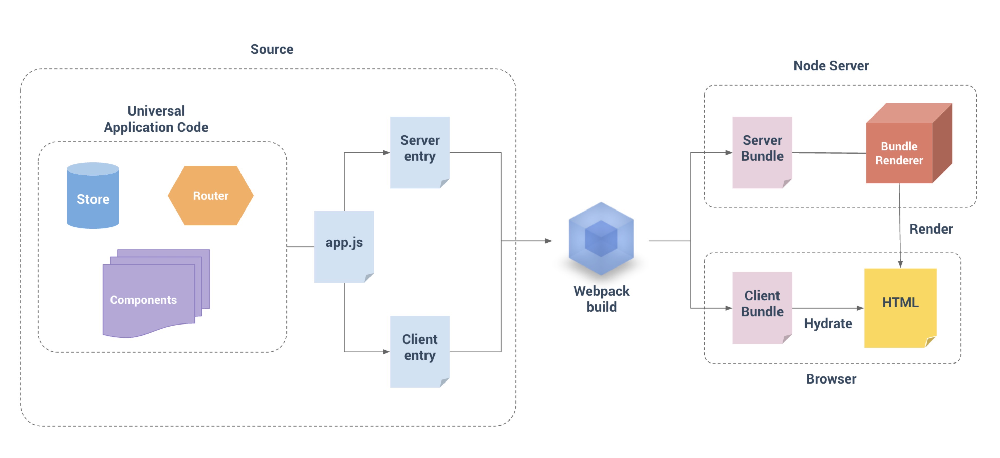

# vue + koa2 + webpack4 构建ssr项目

## 什么是服务器端渲染 (SSR)？为什么使用服务器端渲染 (SSR)？
 
看这 [Vue SSR 指南](https://ssr.vuejs.org/zh/)
  
## 技术栈
- vue、vue-router、vuex
- koa2
- webpack4
- axios
- babel、eslint
- css、stylus、postcss
- pm2

## 目录层次
``` bash
webpack4-ssr-config
├── client # 项目代码目录
│   ├── assets # css、images等静态资源目录
│   ├── components # 项目自定义组件目录
│   ├── plugins # 第三方插件(只能在客户端运行)目录，比如 编辑器
│   ├── store # vuex数据存储目录
│   ├── utils # 通用Mixins目录
│   ├── views # 业务视图.vue和route路由目录
│   ├── app.vue # 
│   ├── config.js # vue组件、mixins注册，http拦截器配置等等
│   ├── entry-client.js # 仅运行于浏览器
│   ├── entry-server.js # 仅运行于服务器
│   ├── index.js # 通用 entry
│   ├── router.js # 路由配置和相关钩子配置
│   └── routes.js # 汇聚业务模块所有路由route配置
├── config # 配置文件目录
│   ├── http # axios封装的http请求
│   ├── logger # .vue里this.[log,warn,info,error]和koa2里 logger日志输出
│   ├── middle # koa2中间件目录
│   │   ├── errorMiddleWare.js # 错误处理中间件
│   │   ├── proxyMiddleWare.js # 接口代理中间件
│   │   └── staticMiddleWare.js # 静态资源中间件
│   ├── eslintrc.conf.js # eslint详细配置
│   ├── index.js # server入口
│   ├── koa.server.js # koa2服务详细配置
│   ├── setup.dev.server.js # koa2开发模式实现hot热更新
│   ├── vue.koa.ssr.js # vue ssr的koa2中间件。匹配路由、请求接口生成dom，实现SSR
│   ├── webpack.base.config.js # 基本配置 (base config) 
│   ├── webpack.client.config.js # 客户端配置 (client config)
│   └── webpack.server.config.js # 服务器配置 (server config)
├── dist # 代码打包目录
├── log # pm2日志输出目录
├── node_modules # node包
├── .babelrc # babel配置
├── .eslintrc.js # eslint配置
├── .gitignore # git配置
├── app.config.js # 端口、代理配置、webpack配置等等
├── constants.js # 存放常量
├── favicon.ico # ico图标
├── index.template.ejs # index模板
├── package.json # 
├── package-lock.json # 
├── pm2.config.js # 项目pm2配置
├── pm2.md # pm2的api文档
├── postcss.config.js # postcss配置文件
└── README.md # 文档
```

## 源码结构

### 构建
使用 webpack 来打包我们的 Vue 应用程序，参考官方分成3个配置，这里使用的webpack4和官方的略有区别。

```bash
├── webpack.base.config.js # 基本配置 (base config) 
├── webpack.client.config.js # 客户端配置 (client config)
├── webpack.server.config.js # 服务器配置 (server config)
```
具体webpack配置代码这里省略...

对于客户端应用程序和服务器应用程序，我们都要使用 webpack 打包 - 服务器需要「服务器 bundle」然后用于服务器端渲染(SSR)，
而「客户端 bundle」会发送给浏览器，用于混合静态标记。基本流程如下图：



### 项目代码
```bash
├── entry-client.js # 仅运行于浏览器
├── entry-server.js # 仅运行于服务器
├── index.js # 通用 entry
├── router.js # 路由配置
├── routes.js # 汇聚业务模块所有路由route配置
```
#### `index.js` 
`index.js` 是我们应用程序的「通用 entry」,对外导出一个 createApp 函数。这里使用工厂模式为为每个请求创建一个新的根 Vue 实例，
从而避免server端单例模式，如果我们在多个请求之间使用一个共享的实例，很容易导致交叉请求状态污染 (cross-request state pollution)。

#### `entry-client.js`:

客户端 entry 只需创建应用程序，并且将其挂载到 DOM 中：

``` js
import Vue from 'vue'
import { createApp } from './index'
// 引入http请求
import http from './../config/http/http'
......
const { app, router, store } = createApp()

if (window.__INITIAL_STATE__) {
  store.replaceState(window.__INITIAL_STATE__)
  // 客户端和服务端保持一致
  store.state.$http = http
}

router.onReady(() => {
    ......
    Promise.all(asyncDataHooks.map(hook => hook({ store, router, route: to })))
      .then(() => {
        bar.finish()
        next()
      })
      .catch(next)
  })
  // 挂载
  app.$mount('#app')
})
```

#### `entry-server.js`:

服务器 entry 使用 default export 导出函数，并在每次渲染中重复调用此函数。此时，除了创建和返回应用程序实例之外，
还在此执行服务器端路由匹配和数据预取逻辑。

``` js
import { createApp } from './index'
// 引入http请求
import http from './../config/http/http'
// 处理ssr期间cookies穿透
import { setCookies } from './../config/http/http'

// 客户端特定引导逻辑……
const { app } = createApp()

// 这里假定 App.vue 模板中根元素具有 `id="app"`
app.$mount('#app')

export default context => {
  return new Promise((resolve, reject) => {
    const { app, router, store } = createApp()
    const { url } = context
    ......
    // 设置服务器端 router 的位置,路由配置里如果设置过base，url需要把url.replace(base,'')掉，不然会404
    router.push(url)

    // 等到 router 将可能的异步组件和钩子函数解析完
    router.onReady(() => {
      ......
      // SSR期间同步cookies
      setCookies(context.cookies || {})
      // http注入到rootState上，方便store里调用
      store.state.$http = http
      // 使用Promise.all执行匹配到的Component的asyncData方法，即预取数据
      Promise.all(matchedComponents.map(({ asyncData }) => asyncData && asyncData({
        store,
        router,
        route: router.currentRoute,
      }))).then(() => {
        // 在所有预取钩子(preFetch hook) resolve 后，
        // 我们的 store 现在已经填充入渲染应用程序所需的状态。
        // 当我们将状态附加到上下文，
        // 并且 `template` 选项用于 renderer 时，
        // 状态将自动序列化为 `window.__INITIAL_STATE__`，并注入 HTML。
        context.state = store.state
        resolve(app)
      }).catch(reject)
    }, reject)
  })
}
```

#### `router.js`、`routes.js`、`store.js`
router和store也都是工厂模式，routes是业务模块路由配置的集合。

router
```js
import Vue from 'vue'
import Router from 'vue-router'
import routes from './routes'

Vue.use(Router)

export function createRouter() {
  const router = new Router({
    mode: 'history',
    fallback: false,
    // base: '/ssr',
    routes
  })

  router.beforeEach((to, from, next) => {
    /*todo
    * 做权限验证的时候，服务端和客户端状态同步的时候会执行一次
    * 建议vuex里用一个状态值控制，默认false，同步时直接next,因为服务端已经执行过。
    * */
    next()
  })

  router.afterEach((route) => {
    /*todo*/
  })
  return router
}
```
route
```js
import testRoutes from './views/test/routes'
import entry from './app.vue'

const home = () => import('./views/home.vue')
const routes = [
  {
    path: '/',
    component: home
  },
  {
    path: '/test',
    component: entry,
    children: testRoutes
  },
]
export default routes
```
store
```js
import Vue from 'vue'
import Vuex from 'vuex'
import test from './modules/test'

Vue.use(Vuex)

export function createStore() {
  return new Vuex.Store({
    modules: {
      test
    }
  })
}
```

### http请求
http使用Axios库封装

```js
/**
 * Created by zdliuccit on 2019/1/14.
 * @file axios封装
 * export default http 接口请求
 * export addRequestInterceptor 请求前拦截器
 * export addResponseInterceptor 请求后拦截器
 * export setCookies 同步cookie
 */
import axios from 'axios'

const currentIP = require('ip').address()
const appConfig = require('./../../app.config')

const defaultHeaders = {
  Accept: 'application/json, text/plain, */*; charset=utf-8',
  'Content-Type': 'application/json; charset=utf-8',
  Pragma: 'no-cache',
  'Cache-Control': 'no-cache',
}
Object.assign(axios.defaults.headers.common, defaultHeaders)

if (!process.browser) {
  axios.defaults.baseURL = `http://${currentIP}:${appConfig.appPort}`
}
const methods = ['get', 'post', 'put', 'delete', 'patch', 'options', 'request', 'head']

const http = {}
methods.forEach(method => {
  http[method] = axios[method].bind(axios)
})

export const addRequestInterceptor = (resolve, reject) => {
  if (axios.interceptors.request.handlers.length === 0) axios.interceptors.request.use(resolve, reject)
}
export const addResponseInterceptor = (resolve, reject) => {
  if (axios.interceptors.response.handlers.length === 0) axios.interceptors.response.use(resolve, reject)
}
export const setCookies = Cookies => axios.defaults.headers.cookie = Cookies

export default http
```


store中已经注入到rootState，使用如下:
```js
loading({ commit, rootState: { $http } }) {
    return $http.get('path').then(res => {
      ...
      })
  }
````
在`config.js`中，把http注册到vue的原型链和配置request、response的拦截器
```js
import Vue from 'vue'
// 引入http请求插件
import http from './../config/http'
// 引入log日志插件
import { addRequestInterceptor, addResponseInterceptor } from './../config/http/http'
import titleMixin from './utils/title'
// 引入log日志插件
import vueLogger from './../config/logger/vue-logger'

// 注册插件
Vue.use(http)
Vue.use(vueLogger)
Vue.mixin(titleMixin)

// request前自动添加api配置
addRequestInterceptor(
  (config) => {
    /*统一加/api前缀*/
    config.url = `/api${config.url}`
    return config
  },
  (error) => {
    return Promise.reject(error)
  }
)

// http 返回response前处理
addResponseInterceptor(
  (response) => {
    /*todo 在这里统一前置处理请求响应 */
    return Promise.resolve(response.data)
  },
  (error) => {
    /*
    * todo 统一处理500、400等错误状态
    * 这里reject下，交给entry-server.js的处理
    */
    const { response, request } = error
    return Promise.reject({ code: response.status, data: response.data, method: request.method, path: request.path })
  }
)
```
这样，.vue中间中直接调用this.$http.get()等等

### cookies穿透
在ssr期间我们需要截取客户端的cookie，保持用户会话唯一性。

在`entry-server.js`中使用setCookies方法，传入的参数是从context上获取。

```js
......
 // SSR期间同步cookies
 setCookies(context.cookies || {})
......
```

在`vue.koa.ssr.js`代码中往context注入cookie
```js
......
 const context = {
      url: ctx.url,
      title: 'Vue Koa2 SSR',
      cookies: ctx.request.headers.cookie
 }
......
```

###

## 部署

### pm2
### nginx


